# <strong >Hey there, I'm LK4z! </strong> 

Brazilian Front-End Developer on a journey since <strong>June 2024</strong>. 
Currently focused on building front-end web applications with <strong>React</strong> and <strong>TypeScript</strong>.  
Passionate about how the <strong>technology</strong> can change our lives.

---

  <ul align="center" style="list-style: none;">
    

      <h1>Tech Stack 🛠️</h1>
    

  </ul>

 

 

 

  <ul align="center" style="list-style: none;">
    

      <h1>Performance & Metrics 📊</h1>
    

  </ul>

 

  
  

 

  
<i>"The mind that opens to a new idea never returns to its original size."</i>

  
<i>- Albert Einstein</i>

